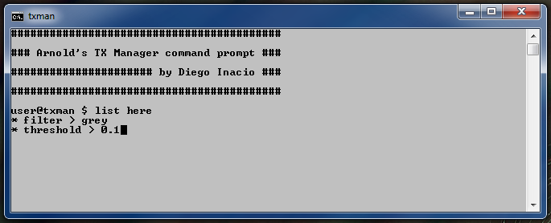

# Arnold's TX Manager command prompt for Windows

This is a command-line application to manage *tx* files for [Arnold](https://www.solidangle.com/arnold/) renderer.

## Installation
 - 1.Download and install [Anaconda](https://www.anaconda.com/download/)(*Python 3.6 version**).
 - 2.Open the command prompt and execute:
 ```bat
 > conda update conda -y
 > conda update anaconda -y
 ```
 To confirm Anaconda's version:
 ```bat
 > conda --version
 ```
 - 3.Clone this repository where you prefer.
 - 4.On command prompt go to cloned *txMan_win* directory and execute:
 ```bat
 > conda env create --file requirements.yml
 ```
 - 5.Add the path of directory to *PATH* environment variable.

## Settings
You can edit the file *"settings.bat"* to make it work properly.

 - To change the user name, edit the appropiate line to:
 ```bat
 > set user=yourName
 ```

## How to use
To execute txMan, go to the images directory that you will make the *tx* files and then run:
```bat
rem activate the "txman" environment.
rem see the installation guide.
> activate txman
rem execute txMan
> txman
```


The anatomy of principal command is:

*[**command**] [**flag**]*

So that the *command* denotes the action and the *flag* indicates the mode of an operation. E.g.:
```
$ list here
```
Where is **list** is the *command* that lists images on screen and **here** is the *flag* which indicates that the analysis will be done in current directory only.

### Main commands
This is the first part of a typical command on *txMan* and will always be followed by a flag. The flag determines the behavior of the command. The main commands are:
 - **list**: Lists image files and prints on the screen.
 - **log**: Lists image files and saves in a log file. The file name will be required.
 - **create**: Creates *tx* files with the same image name. *(this command will always overwrite existing files)*
 - **remove**: Removes *tx* files.

### Command flags
The main command will work according to a flag. The flags basically determines the group that will be analyzed. The flags are:
 - **select**: The command will be applied only on selected images or directories. A *selection* list will be required and the components must be separated by white spaces. Directories must have **"\\"** at the end. E.g.:
 ```
 * selection > imageA.jpg folderA\imageB.jpg folderB\
 ```
 Therefore the principal command will be applied on *imageA.jpg*, *imageB.jpg* inside of the *folderA* and all images and dependencies inside of the *folderB*.
 - **here**: The command will be applied on all images in current directory.
 - **tree**: The command will be applied on all images and dependencies in current directory.

### Filters
Every time that a command is executed a *filter* will be required.


Filters are a way to make an accurate selection of the chosen group. The filters are:
 - **all** : All images on group will be selected.
 - **grey** : Only float and grayscale images will be selected, given a **threshold**.
 - **color** : Only colored or polychromatic images will be selected, given a **threshold**.
 - **regex** : The selection will be given by an *regular expression*.

The filters *grey* and *color* needs a **threshold** to works.



Threshold is a float number parameter that delimits the value **r**, given by:


Where *R*, *G* and *B* represents the image color channels. If **r** is less than *threshold* value then *grey* will be true. Otherwise *color* will be true.

## Color convert
Every time a command *create [flag]* is executed it will be asked if you want to convert the colorspace. If the choice is *yes* then original colorspace and destination colorspace will be required.


The possible values are "**linear**", "**srgb**" (sRGB) and "**rec**" (Rec709). For more information click [here](https://support.solidangle.com/display/AFMUG/Gamma+Correction+and+Linear+Workflow).